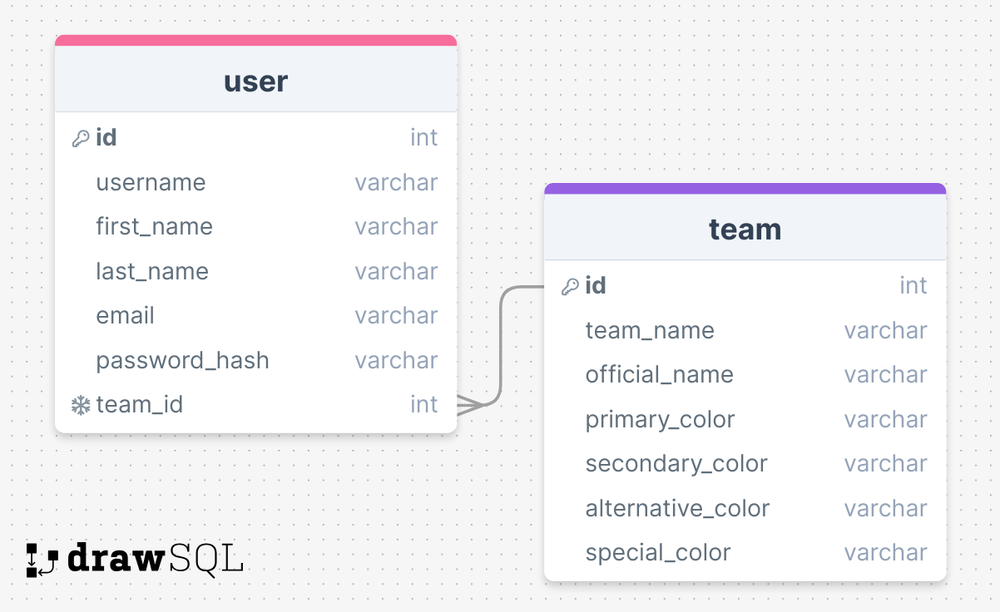

# Project Title

pitstop

## Overview

'pitstop' is a comprehensive dive into the world and stats of Formula 1. Users will be able to customize a Profile Page exactly to their liking. Predefined slots will be available, which allow the user to select exactly which stat or tracker they would like to see. Users will also be able to choose a favourite team, switching the entire theme of the website to match that teams colours. Aside from customization, users will be able to follow the current season by viewing each race weekend's results, as well as having a live session tracker which will allow them to follow along and view stats that they typically won't have access to when streaming live. Finally, the Archive Page will allow users to interact with data throughout the history of the sport. This will contain rankings in main statistical categories, as well as the ability the make custom filtered searches to view rankings of specific statistical categories.

### Problem

Formula 1 has been on the rise for a few years now, yet it still lacks a simple way to view current season and race data as well as historical stats. The go-to spots to get this type of data lack seamless user interaction, and in most cases are clunky and out of date. 'pitstop' will allow users to follow races live and see stats that they otherwise wouldn't have access to while watching the broadcast. This will provide new fans much better insight when trying to learn the complex details of the sport, as well as providing seasoned fans a more in-depth portal to track data and stats as they happen. Formula 1 is growing, but it is focusing more on hooking new fans on the drama of the sport, rather than the complex technical strategies and engineering that true fans fall in love with. 'pitstop' will be a platform to help change that and cater to fans who want to know the sport, rather than just follow the drama.

### User Profile

- Formula 1 Fans:
  - Who have an interest in learning more
  - Who want to see more live stats when watching a race
  - Who want to dive into the statistical history of the sport
  - Who want a reliable site which allows them to follow the sport
  - Who like the idea of having a profile with custom data tracking, as well as a custom theme.

### Features

- As a user, I want to be able to login to my account and view my custom profile page
- As a user, I want to be able to customize what I see on my profile page
- As a user, I want to be able to follow a race weekend live during all the sessions
- As a user, I want to be able to pick a team and have it's theme applied to the website
- As a user, I want to be able to view a list of all drivers and sort by various stats
- As a user, I want to be able to view a list of all teams and sort by various stats
- As a user, I want to be able to see the race details each weekend (e.g. tire allocation, track temperatures, weather predictions, etc.)
- As a user, I want to be able to follow a race session live while also seeing stats that the broadcast doesn't show
- As a user, I want to be able to follow the current season race by race and see how the championships have progressed over time

## Implementation

### Tech Stack

- React
- MySQL
- Node.js
- Express.js
- Client libraries:
  - react-router-dom
  - Axios
  - Sass
  - jsonwebtoken
- Server libraries:
  - Knex
  - bcrypt for password hashing

### APIs

- OpenF1
  - LIVE data
  - Updated every 4s
- Ergast, rapidAPI(API-FORMULA-1, F1 Motorsport Data)
  - Statistical data

### Sitemap

- Welcome
  - Hero Section
  - Log In + Sign Up Forms (also displayed in the fixed header)
- Profile Page
  - Custom theme of selected team
  - Chosen Data and Trackers fill predefined slots
- This Year Page
  - List of all the races
  - Driver & Team standings
  - Championship progression line graphs
- Race Weekend Page
  - Trackers and data for current race weekend
  - Graphic of the current race track
  - All Sessions will have their own view so you can follow practice, qualifying, and the race
- Archive
  - Cards showing the top 3 drivers in chosen main statistical category
  - Each card links to sorted table of all driver stats with the required sort already applied
- Custom Search
  - Table of all the stats which can be filtered to the user's liking

## Mockups

### Welcome Page


### Profile Page


### This Year Page


### Race Weekend Page


### Archive Page


### Custom Search Page


### Data



### Endpoints

**GET /live/drivers**

- "/live" react route
- Get list of drivers currently on track

Parameters:

- User clicks on the current session to populate the data
- Data refreshes every few seconds

Response:

```
[
    {
        "driver_number": 1,
        "full_name": "Max VERSTAPPEN",
        "name_acronym": "VER",
        "session_key": 9158,
        "meeting_key": 1219,
        "headshot_url": "https://www.formula1.com/content/dam/fom-website/drivers/M/MAXVER01_Max_Verstappen/maxver01.png.transform/1col/image.png",
        "team_colour": "3671C6",
        "team_name": "Red Bull Racing"
    },
    ...
]
```

**GET /live/car-data**

- "/live" react route
- Get data from each car currently on track

Parameters:

- User clicks on the current session to populate the data
- Data refreshes every few seconds

Response:

```
[
    {
      "driver_number": 55,
      "brake": 0,
      "date": "2023-09-15T13:08:19.923000+00:00",
      "drs": 12,
      "meeting_key": 1219,
      "n_gear": 8,
      "session_key": 9159,
      "speed": 315,
      "throttle": 99
    },
    ...
]
```

**GET /live/intervals**

- "/live" react route
- Get data regarding the gap to the leader and car ahead

Parameters:

- User clicks on the current session to populate the data
- Data refreshes every few seconds

Response:

```
[
    {
      "driver_number": 1,
      "date": "2023-09-17T13:31:02.395000+00:00",
      "gap_to_leader": 41.019,
      "interval": 0.003,
      "meeting_key": 1219,
      "session_key": 9165
    }
    ...
]
```

**GET /live/race-details**

- "/live" react route
- Get details about each race

Parameters:

- User clicks on which race of the current season they want to view
- User clicks on which session they want to follow and race-data will populate

Response:

```
[
    {
      "circuit_key": 61,
      "circuit_short_name": "Singapore",
      "country_name": "Singapore",
      "date_start": "2023-09-15T09:30:00+00:00",
      "location": "Marina Bay",
      "meeting_key": 1219,
      "meeting_name": "Singapore Grand Prix",
      "meeting_official_name": "FORMULA 1 SINGAPORE AIRLINES SINGAPORE GRAND PRIX 2023",
      "year": 2023
    }
    ...
]
```

**GET /live/pitstops**

- "/live" react route
- Get details about each pitstop for each driver

Parameters:

- User clicks on the current race session to populate the data
- Data refreshes every few seconds

Response:

```
[
    {
      "date": "2023-09-15T09:38:23.038000+00:00",
      "driver_number": 63,
      "lap_number": 5,
      "meeting_key": 1219,
      "pit_duration": 24.5,
      "session_key": 9158
    }
    ...
]
```

**GET /live/positions**

- "/live" react route
- Get data on each driver's position

Parameters:

- User clicks on the current session to populate the data
- Data refreshes every few seconds

Response:

```
[
    {
      "date": "2023-08-26T09:30:47.199000+00:00",
      "driver_number": 40,
      "meeting_key": 1217,
      "position": 2,
      "session_key": 9144
    },
    ...
]
```

**GET /live/sessions**

- "/live" react route
- Get data on each session for the current race weekend

Parameters:

- User clicks on the current session to populate the data
- If the session has yet to happen, details on the start time will be provided

Response:

```
[
    {
      "circuit_key": 7,
      "circuit_short_name": "Spa-Francorchamps",
      "country_name": "Belgium",
      "date_end": "2023-07-29T15:35:00+00:00",
      "date_start": "2023-07-29T15:05:00+00:00",
      "gmt_offset": "02:00:00",
      "location": "Spa-Francorchamps",
      "meeting_key": 1216,
      "session_key": 9140,
      "session_name": "Sprint",
      "session_type": "Race",
      "year": 2023
    }
    ...
]
```

**GET /live/weather**

- "/live" react route
- Get data on the weather at each point in the current session

Parameters:

- User clicks on the current session to populate the data
- Data refreshes every few seconds

Response:

```
[
    {
      "air_temperature": 27.8,
      "date": "2023-05-07T18:42:25.233000+00:00",
      "humidity": 58,
      "meeting_key": 1208,
      "rainfall": 0,
      "session_key": 9078,
      "track_temperature": 52.5,
      "wind_direction": 136,
      "wind_speed": 2.4
    }
    ...
]
```

**GET /stats/standings**

- "/stats" react route
- Get data on the standings for the current season

Parameters:

- Data will populate if the standings have been selected to show on the profile page
- Data will populate when the This Year Page has been rendered

Response:

```
[
  {
    "MRData": {
      "StandingsTable": [
        "season": "2008",
        "StandingsLists": [
          {
            "season": "2008",
            "round": "18",
            "DriverStandings": [
              {
                "position": "1",
                "positionText": "1",
                "points": "98",
                "wins": "5",
                "Driver": {
                  "driver_number": "44",
                  "driver_acronyn": "HAM",
                  "first_name": "Lewis",
                  "last_name": "HAMILTON",
                  "nationality": "British"
                }
                "Constructors": [
                  {
                    "team_name": "McLaren",
                  }
                ]
              }
            ]
          }
        ]
      ]
    }
  },
  ...
]
```

**GET /stats/drivers**

- "/stats" react route
- Get data on each driver

Parameters:

- Data will populate if the Custom Search has been selected or if an Archive Card was selected to view the pre-filtered table
- Data will populate when the the Custom Search Page has rendered

Response:

```
[
  {
    "driver_id": 20
    "driver_name": "Lewis Hamilton"
    "driver_acronym": "HAM"
    "image": "https://media.api-sports.io/formula-1/drivers/20.png"
    "nationality": "British"
    "number": 44
    "races": 340
    "titles": 7
    "podiums": 197
    "wins": 103
    "career_points": 4681.5
  },
  ...
]
```

**GET /track-maps**

- Get the image of the circuit

Parameters:

- Get image when the user loads a session tracker

Response:

```
[
  {
    "id": 1,
    "name": "Albert Park Circuit",
    "image": "https://media.api-sports.io/formula-1/circuits/1.png"
    "competition": [
      "id": 1,
      "name": Australian Grand Prix
    ]
  },
  ...
]
```

### Auth

- JWT auth
  - API calls can only be completed once an account is created
  - Store JWT in sessionStorage, remove after 24h
  - Add states for logged in showing different layouts of the profile page as well as the selected team theme

## Roadmap

- Create GitHub Repository

  - Initialize repository locally and remotely
  - Setup README.md with project overview

- Database Setup

  - Design MySQL database schema for user profiles and team selections
  - Create database with necessary tables
  - users: id, username, first_name, last_name, email, password_hash, team_id
  - teams: id, name, primary_color, secondary_color, alternative_color, special_color
  - Create migrations and seeds for initial user data
  - Seed with current F1 teams

- Server Development

  - Set up Express app with route files
  - Integrate Knex for database interactions
  - Implement authentication with JWT
  - POST /users/register
  - POST /users/login
  - Create API endpoints

- Client Development

  - Initialize React app with Create React App
  - Implement React Router for navigation
  - Create boilerplate pages/components
  - Welcome Page
  - Login & Sign Up Forms
  - Profile Page
  - This Year Page
  - Race Weekend Page
  - Archive Page
  - Custom Search Page
  - Implement Mobile-First design philosophy
  - Create theme switcher for team customization

- Feature Implementation

  - User Authentication
    - Implement login and signup pages with forms
    - Integrate JWT authentication
    - Store JWT in sessionStorage, remove after 24h
  - User Profile
    - Implement profile page where users can select and position prebuilt components
    - Allow users to select favorite team and apply theme
  - Current Season Tracking
    - Implement This Year Page
    - Display list of all races, driver & team standings, and championship progression line graphs
  - Implement Race Weekend Page
    - Trackers and data for the current race weekend
    - Graphic of the current race track
    - Views for all sessions (practice, qualifying, and race)
  - Live Session Tracker
    - Implement live session tracker to follow race live and see additional stats that the broadcast usually doesn't show
    - Update data every 4 seconds using OpenF1 API
  - Historical Data Archive
    - Implement Archive Page
    - Display cards showing the top 3 drivers in main statistical categories
    - Cards link to sorted tables of all driver stats
    - Implement Custom Search Page
    - Allow filtering of stats to user’s preference
  - API Integration
    - Integrate OpenF1 for live data (updated every 4s)
    - Integrate Ergast and RapidAPI for historical and statistical data
    - Implement Axios for API calls from client to server

- Testing and Debugging

  - Conduct thorough testing of all features
  - Fix bugs and ensure the application runs smoothly across different devices and browsers

- Final Touches and Documentation

  - Ensure comprehensive documentation is available for all major components and features
  - Prepare project for demo presentation

- Demo Day
  - Finalize the project and prepare a demo
  - Present the working application highlighting key features and functionalities

## Nice-to-haves

- Individual Driver tracking throughout the session
- Display each drivers exact position on track while following a session
- Compare feature when looking at stats of teams or drivers
- Team stats in the archive as well
- A recent news section showing articles from around the web
- Archive will show full standings and championship tracker for each past season
- A polished F1 Fantasy league would be a massive task but would add tons of value to the site
- Team Radio button to listen to the teams live radio when following an individual driver during a session
- A filter in the search that takes into account the different point system throughout the years so the user can filter drivers based on their overall performance instead of statistical averages
- More options for the user to customize their profile layout

# pitstop-capstone

# capstone
